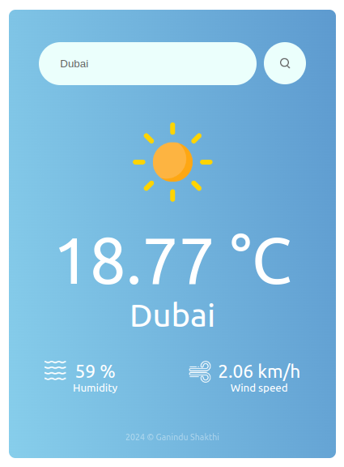

# WeatherApp

A simple weather application built with React, displaying current weather information based on OpenWeatherMap API.

## Features

- Search for weather conditions in different cities
- Displays temperature, location, humidity, wind speed, and weather icon
- Background color and gradient dynamically change based on weather conditions

## Screenshots

